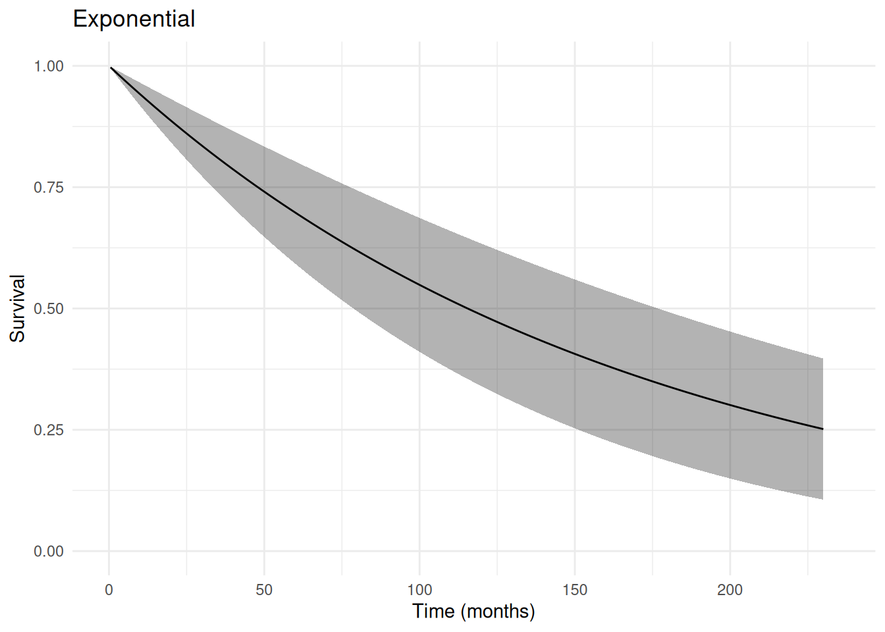
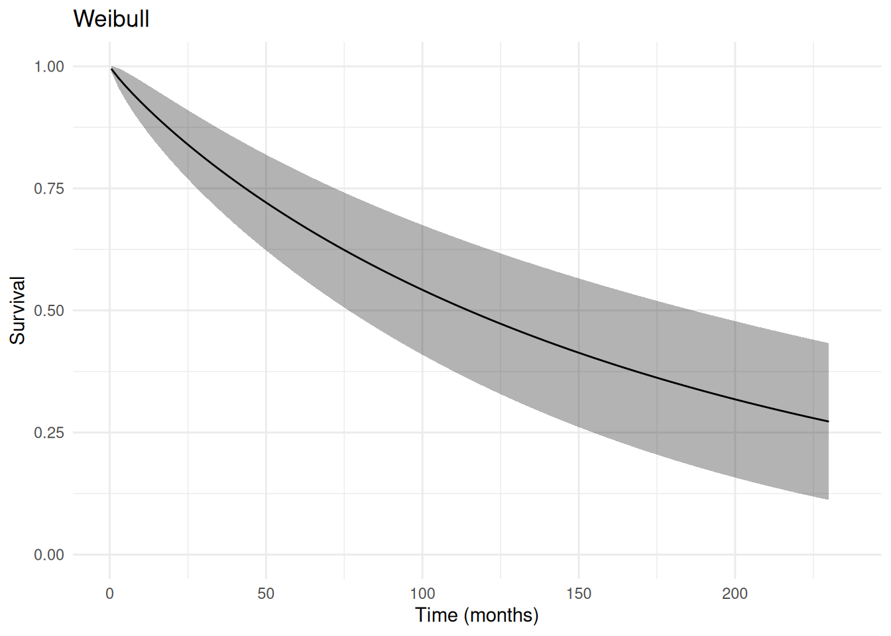
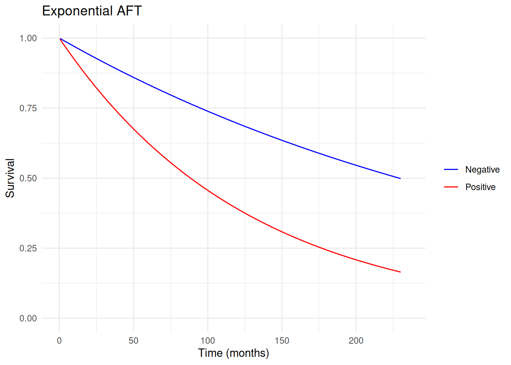
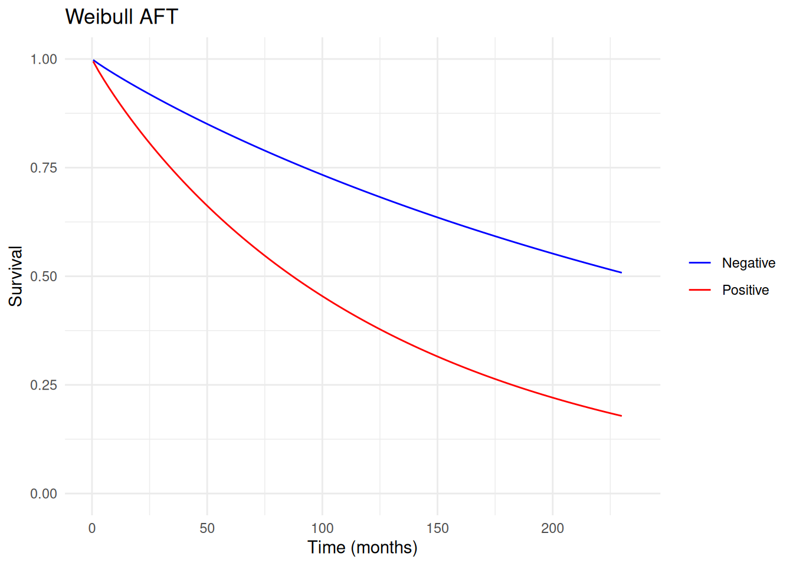
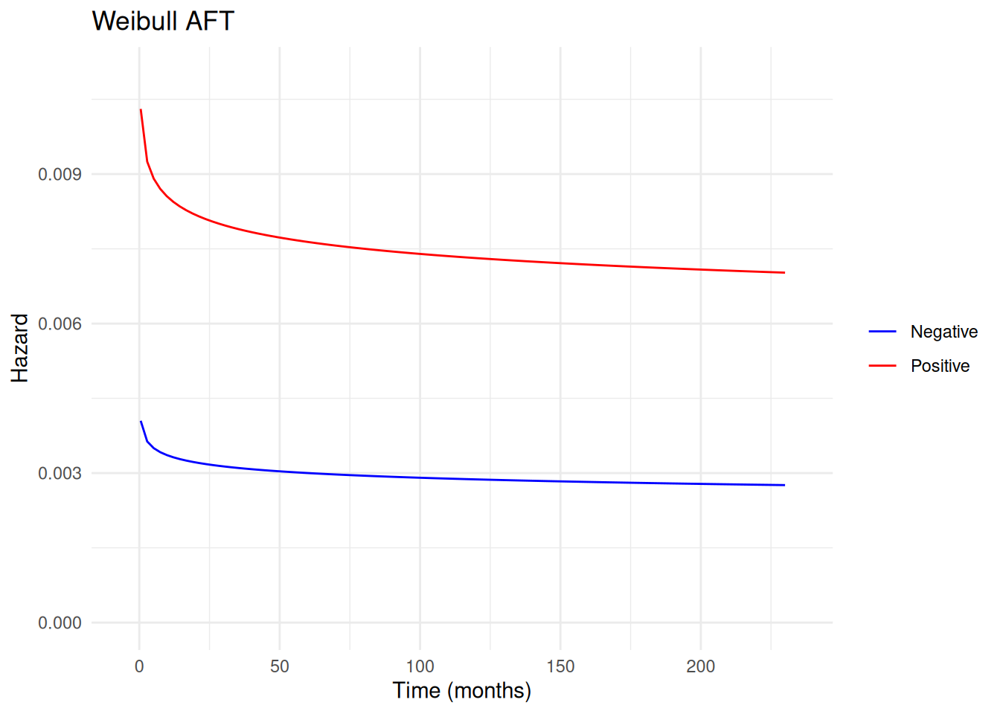
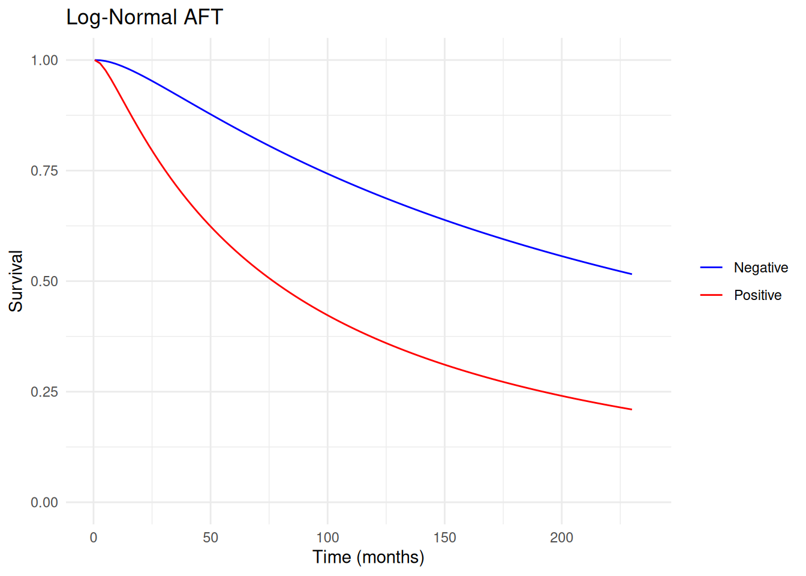
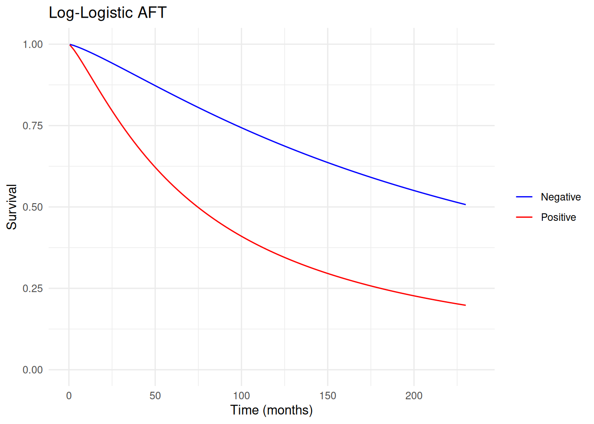
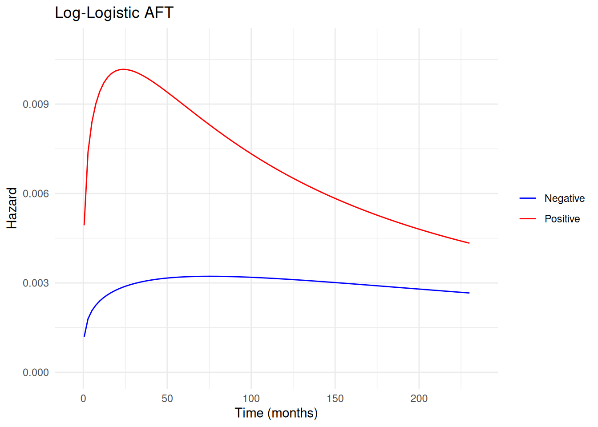

# Collett (2015): Survival Analysis

> **Note**
>
> This article is translated from the [Collett (2015): Survival Analysis
> example](https://deli.readthedocs.io/en/latest/Examples/Collett-Survival.html)
> in the documentation of [delicatessen](https://deli.readthedocs.io/),
> deli’s Python counterpart.

``` r

library(deli)
library(ggplot2)

theme_set(theme_minimal())
```

The following presents some survival analysis methods framed as
M-estimators. The described example and methods are detailed further in
the book by Collett. In survival analysis, we are commonly interested in
estimating the survival or risk at a particular time. However, some
observations are censored (most commonly right censored, which is
exclusively considered hereafter). Therefore, our data is composed of
the observation time (T^\*) and an event indicator (\Delta). The
observation time is usually framed as the minimum of the time-to-event
(T) and time-to-censor (C). Here, we assume that each person has both
times, but we only see T^\* = \min(T,C). The event indicator tells us
which of these two options occurred (\Delta = 1 if it was the event).
Therefore, survival analysis methods consider how to efficiently learn
functions of the time-to-event variable with this partial missingness.
See Collett for a more detailed review of survival analysis and its
methods.

## Data

Here, data on the survival times of 45 women with breast cancer in
Middlesex Hospital July 1987 (Table 1.2) is used. Information was
collected on whether tumors were positively or negatively stained with
HPA. This will be the only covariate included in the analysis.

``` r

# Load the breast cancer data from the deli package
d <- breast_cancer
d$C <- 1

# Time points for drawing survival functions
times_to_predict <- seq(0.5, 230, length.out = 100)
```

Here, `time` (or `times` in R) is the observation time, `status` (or
`delta` in R) is the event indicator, and `stain` is whether the tumor
was HPA stained positive or negative. This data set can also be loaded
via `breast_cancer` in the R `deli` package.

## Chapter 5: Parametric Proportional Hazards Models

To begin, we will simply model the survival times using parametric
models without covariates.

### Exponential

The exponential model is a one parameter model that assumes the hazard
is constant. It is the simplest of the survival models. This model is
parameterized as h(t) = \lambda The following code can be used to fit
the exponential model.

``` r

# Define the estimating equation for the exponential survival model
psi <- function(theta) {
  ee_survival_model(theta = theta,
                    time = d$times,
                    event = d$delta,
                    distribution = "exponential")
}

# Fit the M-estimator
estr <- m_estimate(stacked_equations = psi, init = c(0.01))

# Display the results
results <- data.frame(
  Est = coef(estr),
  SE = sqrt(diag(vcov(estr))),
  LCL = confint(estr)[, 1],
  UCL = confint(estr)[, 2],
  row.names = c("Lambda")
)
round(results, 3)
#>          Est    SE   LCL   UCL
#> Lambda 0.006 0.001 0.003 0.009
```

So the estimated hazard at each time is simply 0.006.

Another more informative way to view the results from this model is to
plot the estimated survival function. The following code generates the
confidence intervals for the survival function at designated times using
the Delta Method.

``` r

# Compute survival predictions with confidence intervals
surv <- survival_predictions(
  times = times_to_predict,
  theta = coef(estr),
  covariance = vcov(estr),
  distribution = "exponential"
)

# Plot the survival function
ggplot(surv, aes(x = time, y = predicted)) +
  geom_ribbon(aes(ymin = lower, ymax = upper), fill = "black", alpha = 0.3) +
  geom_line() +
  coord_cartesian(xlim = c(0, 235), ylim = c(0, 1)) +
  labs(x = "Time (months)", y = "Survival", title = "Exponential")
```



### Weibull

The Weibull model is a two parameter model that is an extension of the
exponential model. Here, the Weibull model is parameterized as h(t) =
\lambda \gamma t^{\gamma - 1} where \gamma is the shape parameter. This
parameter allows for the hazard to increase or decrease monotonically.
The following code is used to fit a Weibull model.

``` r

# Define the estimating equation for the Weibull survival model
psi <- function(theta) {
  ee_survival_model(theta = theta,
                    time = d$times,
                    event = d$delta,
                    distribution = "weibull")
}

# Fit the M-estimator
estr <- m_estimate(stacked_equations = psi, init = c(0.01, 1.0))

# Display the results
results <- data.frame(
  Est = coef(estr),
  SE = sqrt(diag(vcov(estr))),
  LCL = confint(estr)[, 1],
  UCL = confint(estr)[, 2],
  row.names = c("Lambda", "Gamma")
)
round(results, 3)
#>          Est    SE   LCL   UCL
#> Lambda 0.010 0.005 0.000 0.019
#> Gamma  0.904 0.111 0.686 1.122
```

Here, \gamma is near 1, which suggests that the Weibull isn’t much
better of a fit to the data.

As before, we can plot the survival function to get a better idea what
these parameters mean.

``` r

# Compute survival predictions with confidence intervals
surv <- survival_predictions(
  times = times_to_predict,
  theta = coef(estr),
  covariance = vcov(estr),
  distribution = "weibull"
)

# Plot the survival function
ggplot(surv, aes(x = time, y = predicted)) +
  geom_ribbon(aes(ymin = lower, ymax = upper), fill = "black", alpha = 0.3) +
  geom_line() +
  coord_cartesian(xlim = c(0, 235), ylim = c(0, 1)) +
  labs(x = "Time (months)", y = "Survival", title = "Weibull")
```



A disadvantage of the previous models is that they do not incorporate
information on baseline covariates.

## Chapter 6: Accelerated Failure Time and Other Parametric Models

Now we will switch focus to modeling survival by baseline covariates.
The following is a line-diagram which represents the follow-up time for
each individual (horizontal line), their event indicator (open circles
are censoring, x’s are events), and the HPA stain status (shaded is
negative).

In this case, we can see there seems to be some pattern in survival by
HPA stain. However, there is censoring and our description here is
pretty general. To help make our descriptions of survival differences
more precise, we will use AFT models.

Here, we consider use of accelerated failure time (AFT) models with
right censored data. These parametric models allow us to study how
baseline variables are related to survival. AFT models are named because
their scale parameters can be interpreted as how a baseline variable
‘accelerates’ the outcome. This acceleration is the ratio between the
times when the survival are equal for a one unit change in the
covariate. Alternatively, we can think about the parameters of this
model as the ratio of mean survival times by covariate values.

The AFT model can be represented as a log-linear model: \log(T_i) =
\beta_0 + \beta_1 X_i + \sigma \epsilon_i where different distributions
for \epsilon provide different parametric AFT models. Here, \sigma is
the shape parameter. It will be the parameter that varies in meaning
between the different parametric distributions. The \beta’s are the
scale factors which give us the acceleration factors, which can be
interpreted as “the time to death given X=1 is accelerated by a factor
of \exp(-\beta_1)”.

For further details on the structure and interpretation of AFT models,
see the Collett book.

### Exponential

To start, we consider the exponential AFT model. The exponential AFT
model assumes a constant hazard, which is likely too simple for most
settings. However, it can be useful to use as a starting point. The
following is code to fit this AFT model using the `ee_aft` built-in
estimating equation.

``` r

# Define the estimating equation for the exponential AFT model
psi <- function(theta) {
  ee_aft(theta = theta,
         X = as.matrix(d[, c("C", "stain")]),
         time = d$times,
         event = d$delta,
         distribution = "exponential")
}

# Fit the M-estimator
estr <- m_estimate(stacked_equations = psi, init = c(6.0, 0.0))

# Display the results
results <- data.frame(
  Est = coef(estr),
  SE = sqrt(diag(vcov(estr))),
  LCL = confint(estr)[, 1],
  UCL = confint(estr)[, 2],
  row.names = c("Intercept", "Stain")
)
round(results, 3)
#>              Est    SE    LCL   UCL
#> Intercept  5.800 0.431  4.956 6.645
#> Stain     -0.952 0.497 -1.926 0.023
```

Here, \exp(0.952) would be the acceleration factor due to a positive HPA
stain (note the cancellation of the negative signs).

Another informative way to view these results is through a plot of the
survival functions. The following code computes the survival function
(at user-provided time points) for a specific covariate pattern. Here,
we only consider HPA stain. The next block uses these predictions (and
their confidence intervals) to plot the survival functions by HPA stain.

``` r

# Compute individual-level AFT predictions for each stain group
surv_neg <- aft_predictions_individual(
  X = matrix(c(1, 0), nrow = 1),
  times = times_to_predict,
  theta = coef(estr),
  distribution = "exponential"
)

surv_pos <- aft_predictions_individual(
  X = matrix(c(1, 1), nrow = 1),
  times = times_to_predict,
  theta = coef(estr),
  distribution = "exponential"
)

# Plot the survival functions by stain group
aft_surv <- data.frame(
  time = rep(times_to_predict, 2),
  survival = c(as.numeric(surv_neg), as.numeric(surv_pos)),
  stain = factor(
    rep(c("Negative", "Positive"), each = length(times_to_predict)),
    levels = c("Negative", "Positive")
  )
)

ggplot(aft_surv, aes(x = time, y = survival, color = stain)) +
  geom_line() +
  scale_color_manual(values = c(Negative = "blue", Positive = "red")) +
  coord_cartesian(xlim = c(0, 235), ylim = c(0, 1)) +
  labs(
    x = "Time (months)",
    y = "Survival",
    title = "Exponential AFT",
    color = NULL
  )
```



This plot summarizes how survival unfolds over time. These plots can be
helpful with interpreting or presenting results beyond the table of
estimated parameters given previously.

### Weibull

The next model is the Weibull AFT model, which is a two-parameter
generalization of the exponential model. In particular, it allows the
hazard to vary in a specific monotonic way over time. To assess whether
the exponential AFT model is reasonable, one can fit a Weibull model and
assess whether the shape parameter (\sigma) is different from 1.

Below is how one can fit a Weibull AFT model with `ee_aft`.

``` r

# Define the estimating equation for the Weibull AFT model
psi <- function(theta) {
  ee_aft(theta = theta,
         X = as.matrix(d[, c("C", "stain")]),
         time = d$times,
         event = d$delta,
         distribution = "weibull")
}

# Fit the M-estimator
estr <- m_estimate(stacked_equations = psi, init = c(5.0, 0.0, 0.0))

# Display the results
results <- data.frame(
  Est = coef(estr),
  SE = sqrt(diag(vcov(estr))),
  LCL = confint(estr)[, 1],
  UCL = confint(estr)[, 2],
  row.names = c("Intercept", "Stain", "Shape")
)
round(results, 3)
#>              Est    SE    LCL   UCL
#> Intercept  5.854 0.483  4.909 6.800
#> Stain     -0.997 0.532 -2.039 0.046
#> Shape     -0.065 0.126 -0.311 0.182
```

Note that the shape parameter here is the log-transformed version, so
\exp(-0.065) is near one. This suggests that a Weibull AFT model
provides a pretty similar fit to an exponential AFT model for this data.
We can compare this to the results reported in Collett (pg 245). There
we see that the intercept (\mu in Collett) and stain (\hat{\alpha} in
Collett) match to the reported number of decimal places. Note that the
\sigma in `delicatessen` is the inverse of the one reported in Collett.

Below is code to generate a plot of the survival functions. As the shape
parameter is near one, this plot is expected to be similar to the
exponential AFT model plot.

``` r

# Compute individual-level AFT predictions for each stain group
surv_neg <- aft_predictions_individual(
  X = matrix(c(1, 0), nrow = 1),
  times = times_to_predict,
  theta = coef(estr),
  distribution = "weibull"
)

surv_pos <- aft_predictions_individual(
  X = matrix(c(1, 1), nrow = 1),
  times = times_to_predict,
  theta = coef(estr),
  distribution = "weibull"
)

# Plot the survival functions by stain group
aft_surv <- data.frame(
  time = rep(times_to_predict, 2),
  survival = c(as.numeric(surv_neg), as.numeric(surv_pos)),
  stain = factor(
    rep(c("Negative", "Positive"), each = length(times_to_predict)),
    levels = c("Negative", "Positive")
  )
)

ggplot(aft_surv, aes(x = time, y = survival, color = stain)) +
  geom_line() +
  scale_color_manual(values = c(Negative = "blue", Positive = "red")) +
  coord_cartesian(xlim = c(0, 235), ylim = c(0, 1)) +
  labs(
    x = "Time (months)",
    y = "Survival",
    title = "Weibull AFT",
    color = NULL
  )
```



Other measures can also be plotted. Here, we plot the hazard functions
shown in Figure 6.6 of Collett.

``` r

# Compute individual-level AFT hazard predictions for each stain group
haz_neg <- aft_predictions_individual(
  X = matrix(c(1, 0), nrow = 1),
  times = times_to_predict,
  theta = coef(estr),
  distribution = "weibull",
  measure = "hazard"
)

haz_pos <- aft_predictions_individual(
  X = matrix(c(1, 1), nrow = 1),
  times = times_to_predict,
  theta = coef(estr),
  distribution = "weibull",
  measure = "hazard"
)

# Plot the hazard functions by stain group
aft_haz <- data.frame(
  time = rep(times_to_predict, 2),
  hazard = c(as.numeric(haz_neg), as.numeric(haz_pos)),
  stain = factor(
    rep(c("Negative", "Positive"), each = length(times_to_predict)),
    levels = c("Negative", "Positive")
  )
)

ggplot(aft_haz, aes(x = time, y = hazard, color = stain)) +
  geom_line() +
  scale_color_manual(values = c(Negative = "blue", Positive = "red")) +
  coord_cartesian(xlim = c(-5, 235), ylim = c(0, 0.011)) +
  labs(
    x = "Time (months)",
    y = "Hazard",
    title = "Weibull AFT",
    color = NULL
  )
```



Note that the approximation near t=0 is less precise for the given
spacing used. One could improve its appearance relative to the book by
using a finer resolution.

### Log-Normal

Another option is the log-normal AFT model. The following is how
`ee_aft` can be used to fit the log-normal AFT model.

``` r

# Define the estimating equation for the log-normal AFT model
psi <- function(theta) {
  ee_aft(theta = theta,
         X = as.matrix(d[, c("C", "stain")]),
         time = d$times,
         event = d$delta,
         distribution = "log-normal")
}

# Fit the M-estimator
estr <- m_estimate(stacked_equations = psi, init = c(5.0, 0.0, 0.0))

# Display the results
results <- data.frame(
  Est = coef(estr),
  SE = sqrt(diag(vcov(estr))),
  LCL = confint(estr)[, 1],
  UCL = confint(estr)[, 2],
  row.names = c("Intercept", "Stain", "Shape")
)
round(results, 3)
#>              Est    SE    LCL    UCL
#> Intercept  5.492 0.450  4.609  6.374
#> Stain     -1.151 0.498 -2.127 -0.176
#> Shape     -0.307 0.134 -0.571 -0.043
```

``` r

# Compute individual-level AFT predictions for each stain group
surv_neg <- aft_predictions_individual(
  X = matrix(c(1, 0), nrow = 1),
  times = times_to_predict,
  theta = coef(estr),
  distribution = "log-normal"
)

surv_pos <- aft_predictions_individual(
  X = matrix(c(1, 1), nrow = 1),
  times = times_to_predict,
  theta = coef(estr),
  distribution = "log-normal"
)

# Plot the survival functions by stain group
aft_surv <- data.frame(
  time = rep(times_to_predict, 2),
  survival = c(as.numeric(surv_neg), as.numeric(surv_pos)),
  stain = factor(
    rep(c("Negative", "Positive"), each = length(times_to_predict)),
    levels = c("Negative", "Positive")
  )
)

ggplot(aft_surv, aes(x = time, y = survival, color = stain)) +
  geom_line() +
  scale_color_manual(values = c(Negative = "blue", Positive = "red")) +
  coord_cartesian(xlim = c(0, 235), ylim = c(0, 1)) +
  labs(
    x = "Time (months)",
    y = "Survival",
    title = "Log-Normal AFT",
    color = NULL
  )
```



### Log-Logistic

The final option available in `delicatessen` is the log-logistic AFT
model. The following is how `ee_aft` can be used to fit this model.

``` r

# Define the estimating equation for the log-logistic AFT model
psi <- function(theta) {
  ee_aft(theta = theta,
         X = as.matrix(d[, c("C", "stain")]),
         time = d$times,
         event = d$delta,
         distribution = "log-logistic")
}

# Fit the M-estimator
estr <- m_estimate(stacked_equations = psi, init = c(5.0, 0.0, 0.0))

# Display the results
results <- data.frame(
  Est = coef(estr),
  SE = sqrt(diag(vcov(estr))),
  LCL = confint(estr)[, 1],
  UCL = confint(estr)[, 2],
  row.names = c("Intercept", "Stain", "Shape")
)
round(results, 3)
#>              Est    SE    LCL    UCL
#> Intercept  5.461 0.445  4.589  6.334
#> Stain     -1.149 0.505 -2.139 -0.159
#> Shape      0.217 0.145 -0.067  0.502
```

These parameter estimates are the same as those reported in Collett
(except \sigma due to a differing parameterization).

``` r

# Compute individual-level AFT predictions for each stain group
surv_neg <- aft_predictions_individual(
  X = matrix(c(1, 0), nrow = 1),
  times = times_to_predict,
  theta = coef(estr),
  distribution = "log-logistic"
)

surv_pos <- aft_predictions_individual(
  X = matrix(c(1, 1), nrow = 1),
  times = times_to_predict,
  theta = coef(estr),
  distribution = "log-logistic"
)

# Plot the survival functions by stain group
aft_surv <- data.frame(
  time = rep(times_to_predict, 2),
  survival = c(as.numeric(surv_neg), as.numeric(surv_pos)),
  stain = factor(
    rep(c("Negative", "Positive"), each = length(times_to_predict)),
    levels = c("Negative", "Positive")
  )
)

ggplot(aft_surv, aes(x = time, y = survival, color = stain)) +
  geom_line() +
  scale_color_manual(values = c(Negative = "blue", Positive = "red")) +
  coord_cartesian(xlim = c(0, 235), ylim = c(0, 1)) +
  labs(
    x = "Time (months)",
    y = "Survival",
    title = "Log-Logistic AFT",
    color = NULL
  )
```



Again, we can also plot the hazard functions over time and compare them
to the book (Figure 6.7).

``` r

# Compute individual-level AFT hazard predictions for each stain group
haz_neg <- aft_predictions_individual(
  X = matrix(c(1, 0), nrow = 1),
  times = times_to_predict,
  theta = coef(estr),
  distribution = "log-logistic",
  measure = "hazard"
)

haz_pos <- aft_predictions_individual(
  X = matrix(c(1, 1), nrow = 1),
  times = times_to_predict,
  theta = coef(estr),
  distribution = "log-logistic",
  measure = "hazard"
)

# Plot the hazard functions by stain group
aft_haz <- data.frame(
  time = rep(times_to_predict, 2),
  hazard = c(as.numeric(haz_neg), as.numeric(haz_pos)),
  stain = factor(
    rep(c("Negative", "Positive"), each = length(times_to_predict)),
    levels = c("Negative", "Positive")
  )
)

ggplot(aft_haz, aes(x = time, y = hazard, color = stain)) +
  geom_line() +
  scale_color_manual(values = c(Negative = "blue", Positive = "red")) +
  coord_cartesian(xlim = c(-5, 235), ylim = c(0, 0.011)) +
  labs(
    x = "Time (months)",
    y = "Hazard",
    title = "Log-Logistic AFT",
    color = NULL
  )
```



Consistent with the other results, the log-logistic AFT model does not
differ substantially from the other AFT models.

Here, we applied some of the parametric survival models described at
length in Collett using the M-estimation framework. As these models are
all finite dimension parameter vectors, standard M-estimation theory
straightforwardly applies. A benefit in this context is the ease that
variance estimation can be accomplished to create plots with point-wise
confidence intervals.

## References

Collett, D. (2015). Survival analysis. In *Modelling survival data in
medical research*. 3rd Ed. Chapman and Hall/CRC. pg 6-7

Collett, D. (2015). Accelerated failure time and other parametric
models. In *Modelling survival data in medical research*. 3rd Ed.
Chapman and Hall/CRC. pg 221-274
