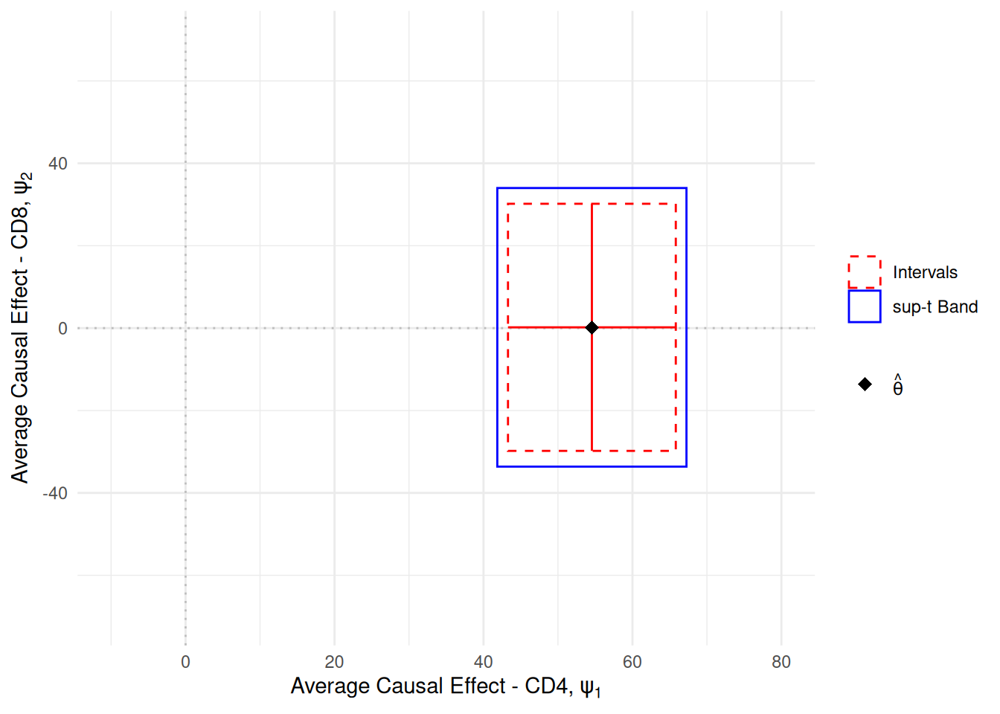
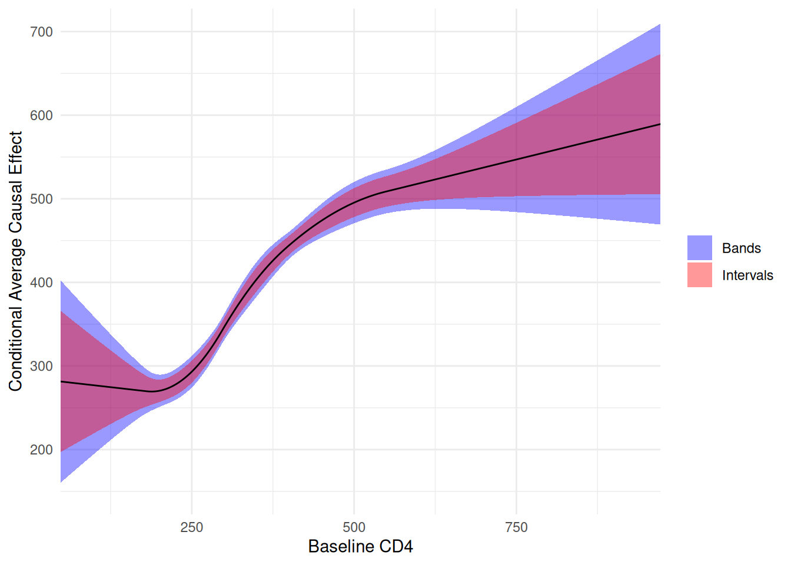

# Zivich et al. (2025): Confidence Bands

> **Note**
>
> This article is translated from the [Zivich et al. (2025): An
> Introduction to Confidence Bands
> example](https://deli.readthedocs.io/en/latest/Examples/Zivich-CBands.html)
> in the documentation of [delicatessen](https://deli.readthedocs.io/),
> deli’s Python counterpart.

``` r

library(deli)
library(ggplot2)

theme_set(theme_minimal())
```

Zivich et al. (2025) provides an introduction to different types of
confidence regions, including confidence bands. Briefly, confidence
bands are an extension of confidence intervals for vectors (or multiple)
parameters. The issue with standard confidence intervals, is that they
only claim a single parameter at that rate. When considering coverage
for *multiple* parameters, simultaneous confidence interval coverage can
be far below the nominal rate. Confidence bands are a set of intervals
for a set of parameters.

In Zivich et al., the primary focus is on the sup-t method for computing
the confidence bands. The sup-t method adjusts the overall critical
value such that it provides a set of confidence regions corresponding to
the 1-\alpha coverage rate. See the publication for further details on
the procedure.

Here, we will replicate the analysis shown in the Supplementary
Materials of Zivich et al. This example covers the usage of confidence
bands with nuisance parameter estimation. Data comes from the AIDS
Clinical Trial Group (ACTG) 175, which compared 2-drug versus 1-drug
antiretroviral therapy for the prevention of disease progression among
people with HIV.

## Data

``` r

d <- actg175
```

## Case Study 1: Multiple Outcomes

For the first case, we are interested in the average causal effect of
2-drug versus 1-drug antiretroviral therapy on CD4 and CD8 T cell counts
20-weeks post-randomization. CD4 and CD8 are immunological markers often
used to assess immune function, and CD4 is a particular important
immunological marker for assessing disease progression among people with
HIV.

Here, we are interested in a *pair* of parameters, which we might
indicate as a vector with two elements. For statistical inference, we
want coverage for both parameters simultaneously. As such, reporting the
confidence bands is appropriate here.

``` r

# Design matrix for propensity score model
g_formula <- ~ white + male + idu + factor(karnof) +
  age + age_rs1 + age_rs2 + age_rs3 +
  cd4c_0wk + cd4_rs1 + cd4_rs2 + cd4_rs3 +
  cd8c_0wk + cd8_rs1 + cd8_rs2 + cd8_rs3
Wmat <- model.matrix(g_formula, data = d)
a <- d$treat
y1 <- d$cd4_20wk
y2 <- d$cd8_20wk
n <- length(a)
n_alpha <- ncol(Wmat)
```

``` r

estfunc <- function(theta) {
  # Dividing up the parameters
  psi_y <- theta[1]
  psi_z <- theta[2]
  mu_1 <- theta[3]
  mu_0 <- theta[4]
  om_1 <- theta[5]
  om_0 <- theta[6]
  alpha <- theta[7:(6 + n_alpha)]

  # Constructing inverse probability weights
  pi_a <- inverse_logit(drop(Wmat %*% alpha))
  ipw <- a / pi_a + (1 - a) / (1 - pi_a)

  # Estimating function for propensity score
  ef_ps <- ee_regression(theta = alpha, X = Wmat, y = a, model = "logistic")

  # Estimating functions for causal parameters
  ef_psi1 <- matrix(rep(mu_1 - mu_0, n), nrow = 1) - theta[1]
  ef_psi2 <- matrix(rep(om_1 - om_0, n), nrow = 1) - theta[2]
  ef_mu1 <- matrix(a * ipw * (y1 - mu_1), nrow = 1)
  ef_mu0 <- matrix((1 - a) * ipw * (y1 - mu_0), nrow = 1)
  ef_om1 <- matrix(a * ipw * (y2 - om_1), nrow = 1)
  ef_om0 <- matrix((1 - a) * ipw * (y2 - om_0), nrow = 1)

  # Returning stacked estimating functions
  rbind(ef_psi1, ef_psi2, ef_mu1, ef_mu0, ef_om1, ef_om0, ef_ps)
}

# Estimating the parameters
inits <- c(0, 0, 300, 300, 300, 300, rep(0, n_alpha))
estr <- m_estimate(stacked_equations = estfunc, init = inits)
psi <- estr@theta

# Confidence intervals
ci <- confint(estr)
# Confidence bands (1-based subset for R)
cb <- confidence_bands(estr, method = "supt", subset = 1:2, seed = 10177L)
```

The 95% confidence intervals for the two causal effects are

``` r

ci[1:2, ]
#>             lower    upper
#> theta_1  43.28997 65.81966
#> theta_2 -29.79386 30.18211
```

and the 95% confidence bands are

``` r

cb
#>             lower    upper
#> theta_1  41.85505 67.25457
#> theta_2 -33.61372 34.00197
```

As shown here, the confidence bands encapsulate the confidence
intervals. These wider intervals are the price we pay to have
simultaneous coverage of our parameters. However, this drop in precision
is important since our interest (and thus our interpretations) are for
more than one parameter. This distinction between confidence regions is
slightly easier to understand visually.

One item to note here is that the confidence bands were only computed
for a *subset* of the parameter vector (i.e., the `subset` argument).
This is due to the our inference only being on the parameters of
interest. When computing the confidence bands here, we can ignore the
nuisance parameters (since we are not making inference for them).

``` r

# Plot confidence intervals and bands
region_levels <- c("Intervals", "sup-t Band")
regions <- data.frame(
  region = factor(region_levels, levels = region_levels),
  xmin = c(ci[1, 1], cb[1, 1]),
  xmax = c(ci[1, 2], cb[1, 2]),
  ymin = c(ci[2, 1], cb[2, 1]),
  ymax = c(ci[2, 2], cb[2, 2])
)

# Confidence intervals as lines through the point estimate
crosshairs <- data.frame(
  x = c(ci[1, 1], psi[1]),
  xend = c(ci[1, 2], psi[1]),
  y = c(psi[2], ci[2, 1]),
  yend = c(psi[2], ci[2, 2])
)

# Estimated parameters
estimate <- data.frame(x = psi[1], y = psi[2])

ggplot() +
  # Reference lines for the null
  geom_hline(yintercept = 0, linetype = 3, color = "gray") +
  geom_vline(xintercept = 0, linetype = 3, color = "gray") +
  geom_rect(
    data = regions,
    aes(
      xmin = xmin,
      xmax = xmax,
      ymin = ymin,
      ymax = ymax,
      color = region,
      linetype = region
    ),
    fill = NA
  ) +
  geom_segment(
    data = crosshairs,
    aes(x = x, xend = xend, y = y, yend = yend),
    color = "red"
  ) +
  geom_point(data = estimate, aes(x = x, y = y, shape = "estimate"), size = 3) +
  scale_color_manual(values = c("Intervals" = "red", "sup-t Band" = "blue")) +
  scale_linetype_manual(values = c("Intervals" = 2, "sup-t Band" = 1)) +
  scale_shape_manual(
    values = c(estimate = 18),
    labels = expression(hat(theta))
  ) +
  coord_cartesian(xlim = c(-10, 80), ylim = c(-70, 70)) +
  labs(
    x = expression("Average Causal Effect - CD4, " * psi[1]),
    y = expression("Average Causal Effect - CD8, " * psi[2]),
    color = NULL,
    linetype = NULL,
    shape = NULL
  )
```



Using this visualization, we can imagine the true value of the
parameters as a point in this 2 dimensional Euclidean space. Therefore,
our confidence regions (rectangles here) claim to include that point 95%
of the times as the number of computed regions from new samples goes to
infinity. The red rectangle (implied by the confidence intervals) is too
small to cover the parameter at that rate. The blue rectangle, or
confidence bands, do coverage the true point at that rate.

## Case Study 2: Effect Measure Modification by a Binary Covariate

For the second example, we are interested in studying modification of
the effect of antiretroviral therapy on CD4 by gender. Here, we will
estimate the following marginal structural model E\[Y^a_i \| V; \beta\]
= \beta_0 + \beta_1 a + \beta_2 V_i + \beta_3 a V_i where V_i is gender.
Here, interest is in the full set of \beta parameters (a vector of 4
numbers). Again, confidence bands are appropriate in this setting.

``` r

# Design matrix for propensity score model
g_formula <- ~ white + male + idu + factor(karnof) +
  age + age_rs1 + age_rs2 + age_rs3 +
  cd4c_0wk + cd4_rs1 + cd4_rs2 + cd4_rs3 +
  cd8c_0wk + cd8_rs1 + cd8_rs2 + cd8_rs3
Wmat <- model.matrix(g_formula, data = d)
# Marginal structural model design matrix
msm <- model.matrix(~ treat + male + treat:male, data = d)
a <- d$treat
y <- d$cd4_20wk
n <- length(a)
n_alpha <- ncol(Wmat)
```

``` r

estfunc <- function(theta) {
  beta <- theta[1:4]
  alpha <- theta[5:(4 + n_alpha)]

  # Estimating function for propensity score
  ef_ps <- ee_regression(theta = alpha, X = Wmat, y = a, model = "logistic")

  # Constructing weights
  pi_a <- inverse_logit(drop(Wmat %*% alpha))
  ipw <- a / pi_a + (1 - a) / (1 - pi_a)

  # Estimating function for MSM
  ef_msm <- ee_regression(theta = beta, X = msm, y = y,
                           model = "linear", weights = ipw)

  # Returning stacked estimating functions
  rbind(ef_msm, ef_ps)
}

# Estimating the parameters
inits <- c(300, 0, 0, 0, rep(0, n_alpha))
estr <- m_estimate(stacked_equations = estfunc, init = inits)
psi <- estr@theta

# Confidence intervals
ci <- confint(estr)
# Confidence bands (1-based subset for R)
cb <- confidence_bands(estr, method = "supt", subset = 1:4, seed = 10177L)
```

``` r

# Display results
data.frame(
  Names = colnames(msm),
  Estimate = round(psi[1:4], 1),
  Interval = sapply(1:4, function(i) {
    paste0("[", round(ci[i, 1], 1), " ", round(ci[i, 2], 1), "]")
  }),
  Bands = sapply(1:4, function(i) {
    paste0("[", round(cb[i, 1], 1), " ", round(cb[i, 2], 1), "]")
  })
)
#>               Names Estimate      Interval         Bands
#> theta_1 (Intercept)    355.8 [327.5 384.2] [323.1 388.6]
#> theta_2       treat     43.4    [8.1 78.7]    [2.6 84.2]
#> theta_3        male    -27.1   [-58.9 4.7]   [-63.8 9.6]
#> theta_4  treat:male     13.5  [-26.5 53.6]  [-32.7 59.7]
```

Again, the bands compensate for the fact that we are interested in
simultaneous inference. Additionally, we restrict the computation of the
confidence bands only to the parameters of interest (the first 4
parameters of `theta`).

## Case Study 3: Effect Measure Modification by a Continuous Covariate

For the final example, we are interested in studying modification by
*baseline* CD4 cell counts. Again, we will use a marginal structural
model. However, for a continuous variable we want to model it flexibly
in our model. However, flexibly modeling a continuous variable makes it
challenging to interpret. Thus, we plot the conditional average causal
effect over values of baseline CD4 for interpretative purposes.

The first part of the code will estimate the parameters of the specified
marginal structural model.

``` r

# Design matrix for propensity score model
g_formula <- ~ white + male + idu + factor(karnof) +
  age + age_rs1 + age_rs2 + age_rs3 +
  cd4c_0wk + cd4_rs1 + cd4_rs2 + cd4_rs3 +
  cd8c_0wk + cd8_rs1 + cd8_rs2 + cd8_rs3
Wmat <- model.matrix(g_formula, data = d)

# Marginal structural model design matrix with spline interaction
msm <- model.matrix(
  ~ treat + cd4c_0wk + cd4_rs1 + cd4_rs2 + cd4_rs3 +
    treat:(cd4c_0wk + cd4_rs1 + cd4_rs2 + cd4_rs3),
  data = d
)
a <- d$treat
y <- d$cd4_20wk
n <- length(a)
n_alpha <- ncol(Wmat)
msm_size <- ncol(msm)
```

``` r

estfunc <- function(theta) {
  beta <- theta[1:msm_size]
  alpha <- theta[(msm_size + 1):(msm_size + n_alpha)]

  # Estimating function for propensity score
  ef_ps <- ee_regression(theta = alpha, X = Wmat, y = a, model = "logistic")

  # Constructing weights
  pi_a <- inverse_logit(drop(Wmat %*% alpha))
  ipw <- a / pi_a + (1 - a) / (1 - pi_a)

  # Estimating function for MSM
  ef_msm <- ee_regression(theta = beta, X = msm, y = y,
                           model = "linear", weights = ipw)

  # Returning stacked estimating functions
  rbind(ef_msm, ef_ps)
}

# Estimating the parameters
inits <- c(300, rep(0, msm_size - 1), rep(0, n_alpha))
estr <- m_estimate(stacked_equations = estfunc, init = inits)

psi <- estr@theta[1:msm_size]
v_psi <- estr@variance[1:msm_size, 1:msm_size]
```

To create the plot, we will generate some data across a range of equally
spaced values between the min and max observed CD4 values. Then we will
recreate the splines for this grid (same as those used to fit the
model). Using those values, we will compute the predicted 20-week CD4
from the model parameters using the `regression_predictions` function.
From there, we will construct the covariance matrix of the predictions.
Finally, we can use all those values to compute the confidence bands.

``` r

# Creating grid of CD4 values for plotting
cd4c_grid <- seq(min(d$cd4c_0wk), max(d$cd4c_0wk), length.out = 500)
cd4_grid <- cd4c_grid * sd(d$cd4_0wk) + mean(d$cd4_0wk)

# Create spline terms for prediction grid
cd4_knots <- quantile(d$cd4c_0wk, probs = c(0.05, 0.35, 0.65, 0.95))
cd4_splines <- deli_spline(cd4c_grid, knots = cd4_knots, power = 2,
                            restricted = TRUE)

# Build prediction data frame
dp <- data.frame(
  treat = 1,
  cd4c_0wk = cd4c_grid,
  cd4_rs1 = cd4_splines[, 1],
  cd4_rs2 = cd4_splines[, 2],
  cd4_rs3 = cd4_splines[, 3]
)
Xp <- model.matrix(
  ~ treat + cd4c_0wk + cd4_rs1 + cd4_rs2 + cd4_rs3 +
    treat:(cd4c_0wk + cd4_rs1 + cd4_rs2 + cd4_rs3),
  data = dp
)

# Generating predictions from estimated MSM parameters
y_hat <- regression_predictions(X = Xp, theta = psi, covariance = v_psi)
y_vals <- y_hat$predicted     # Predicted values from model
var_vals <- y_hat$variance    # Variance for predictions

# Covariance matrix for predictions
cov_p <- Xp %*% v_psi %*% t(Xp)
```

``` r

# Compute confidence bands
cb <- compute_confidence_bands(y_vals, covariance = cov_p,
                                method = "supt", seed = 10177L)
```

``` r

# Plot confidence bands and intervals
cace <- data.frame(
  cd4 = cd4_grid,
  estimate = y_vals,
  band_lower = cb[, 1],
  band_upper = cb[, 2],
  interval_lower = y_hat$lower,
  interval_upper = y_hat$upper
)

ggplot(cace, aes(x = cd4, y = estimate)) +
  # Confidence bands shading
  geom_ribbon(
    aes(ymin = band_lower, ymax = band_upper, fill = "Bands"),
    alpha = 0.4
  ) +
  # Confidence intervals shading
  geom_ribbon(
    aes(ymin = interval_lower, ymax = interval_upper, fill = "Intervals"),
    alpha = 0.4
  ) +
  # Prediction line on top
  geom_line() +
  scale_fill_manual(values = c(Bands = "blue", Intervals = "red")) +
  coord_cartesian(xlim = c(90, 930), ylim = c(150, 700)) +
  labs(
    x = "Baseline CD4",
    y = "Conditional Average Causal Effect",
    fill = NULL
  )
```



Again, we can see the confidence intervals provide much too precise of
inference when we are interested in multiple parameters (like a
*function*). While confidence bands have not routinely been used, they
ought to be and `deli` makes them easy to compute.

**NOTE**: A caveat here is that each case study should be interpreted as
if it is independent of the others. If we truly were interested in each
of the parameters of each case study and wanted to report them in a
single paper, then we should adjust our confidence bands for
simultaneous inference on all the parameters described here.

## References

Hammer SM, et al. (1996). “A trial comparing nucleoside monotherapy with
combination therapy in HIV-infected adults with CD4 cell counts from 200
to 500 per cubic millimeter”. *New England Journal of Medicine*,
335(15), 1081-1090.

Zivich PN, Cole SR, Greifer N, Montoya LM, Kosorok MR, & Edwards JK.
(2025). “Confidence Regions for Multiple Outcomes, Effect Modifiers, and
Other Multiple Comparisons”. *arXiv:2510.07076*
