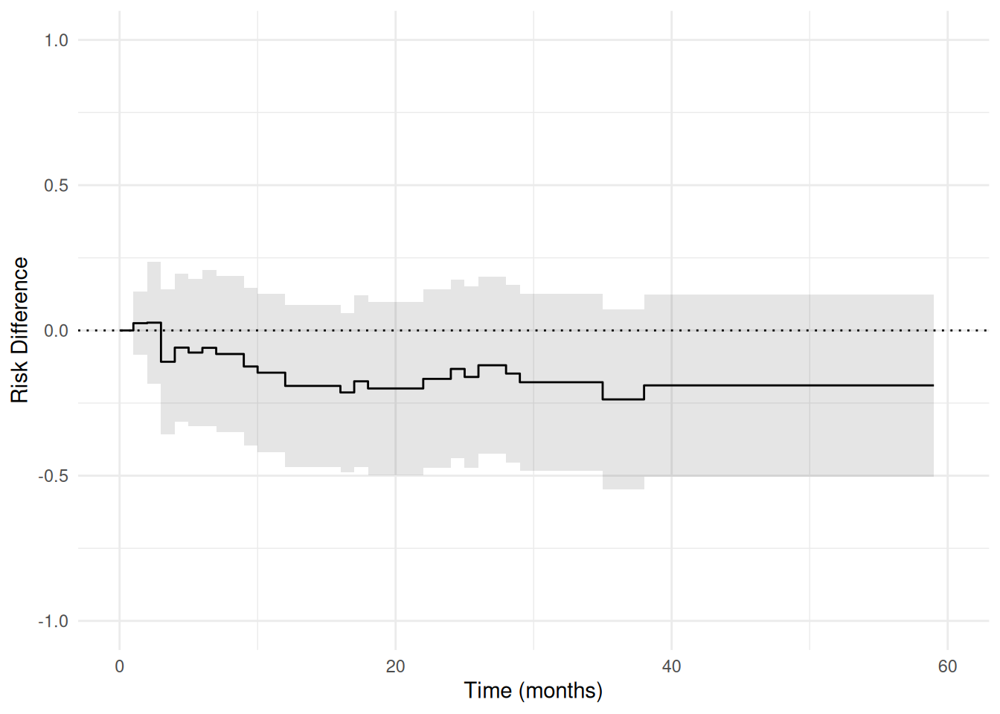
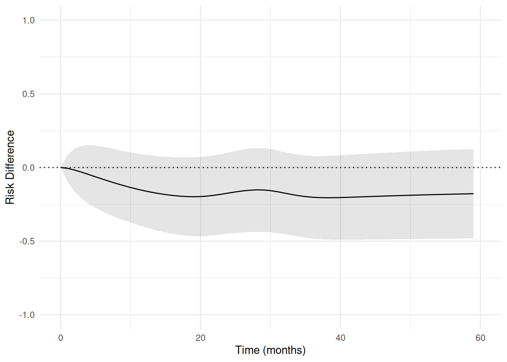

# Zivich: Pooled Logistic Regression

> **Note**
>
> This article is translated from the [Zivich (2026): Pooled Logistic
> Regression for Survival Analysis
> example](https://deli.readthedocs.io/en/latest/Examples/Zivich-PLogit.html)
> in the documentation of [delicatessen](https://deli.readthedocs.io/),
> deli’s Python counterpart.

``` r

library(deli)
library(ggplot2)

theme_set(theme_minimal())
```

In the corresponding pre-print, Zivich et al. propose a novel
implementation of estimating equations for causal survival analysis.
This example reviews those key results and demonstrates how to use
`ee_plogit`. See the corresponding paper for finer details on the full
approach and how it works. This page primarily focuses on how to apply
the code (and not the identification assumptions or underlying
g-computation algorithm described in the paper).

## Example 1: Bladder Cancer Time-to-Recurrence

The first example comes from a data set in Collett (2015). The data
consists of 86 patients who received either placebo or the
chemotherapeutic thiotepa following removal of superficial bladder
tumors, with time measured in months. Baseline variables included the
initial number of tumors and the diameter (in centimeters) of the
largest initial tumor.

``` r

# Load the Collett data
d <- collett_bladder
d$novel <- d$treat - 1
d$intercept <- 1

# Extract arrays for estimation
times <- d$time
y_event <- d$delta
W <- as.matrix(d[, c("novel", "init", "size")])
```

Here, the parameter of interest was the effect comparing novel to
standard treatment on disease-free survival at 59 months (end of
follow-up). While treatment was randomized, both number of tumors and
tumor diameter are adjusted for in this illustration. Here, we will
review how pooled logistic regression can be used for these types of
survival analyses.

### Pooled Logistic Regression

First, examine how a pooled logistic regression model can be fit to the
data. Here, time is modeled using disjoint indicators which is handled
automatically by `ee_plogit` by default.

``` r

# Number of unique event times (for specifying the initial values)
unique_event_times <- unique(d$time[d$delta == 1])
unique_event_times <- sort(unique_event_times)
params_plr <- length(unique_event_times)

# Define the estimating equation
psi_plogit <- function(theta) {
  # ee_plogit: time = observed times, event = event indicator
  ee_plogit(theta, X = W, time = times, event = y_event)
}

# Set initial values
inits <- c(rep(0, ncol(W)),    # Coefs for baseline vars
           -4,                  # Coef for intercept
           rep(0, params_plr - 1))  # Coefs for time terms

# Fit the model
estr <- m_estimate(psi_plogit, init = inits)

# Print results for baseline covariate parameters
summary(estr, subset = seq_len(ncol(W)))
#> ── MEstimator Results ──────────────────────────────────────────────────────────
#> Observations: 86
#> Parameters: 24
#> 
#>           Estimate    Std.Err    Z-score    95% LCL    95% UCL    P-value    S-value
#> theta_1    -0.5479     0.3298    -1.6613    -1.1944     0.0985     0.0967     3.3710
#> theta_2     0.2598     0.0824     3.1535     0.0983     0.4213    0.00161     9.2757
#> theta_3     0.0735     0.0931     0.7898    -0.1089     0.2560       0.43     1.2188
```

Here, we examine the 3 parameters corresponding to the baseline
covariates. As detailed elsewhere, these coefficients can be interpreted
as approximating the hazard ratio. Specifically, the hazard of
recurrence among those on the novel drug is \exp(-0.55) = 0.58 that of
those on placebo, conditional on tumor size and count.

Rather than model time non-parametrically, one can also use parametric
specifications for how the discrete-time hazard of the event changes
over time. As in the paper, we consider the use of splines to model
time. Here, time was modeled using restricted quadratic splines with
knots at 10, 20, 30, and 40 months.

``` r

# Creating time design matrix
t_steps <- seq_len(max(d$time))
intercept <- rep(1, length(t_steps))
time_splines <- deli_spline(t_steps, knots = c(10, 20, 30, 40),
                            power = 2, restricted = TRUE, normalized = FALSE)
s_matrix <- cbind(intercept, t_steps, time_splines)

# Define the estimating equation with spline time design
psi_plogit_spline <- function(theta) {
  ee_plogit(theta, X = W, time = times, event = y_event, S = s_matrix)
}

# Set initial values
inits <- c(rep(0, ncol(W)),    # Coefs for baseline vars
           -4,                  # Coef for intercept
           rep(0, 4))           # Coefs for time terms (intercept + t + 3 spline terms)

# Fit the model
estr <- m_estimate(psi_plogit_spline, init = inits)

# Print results for baseline covariate parameters
summary(estr, subset = seq_len(ncol(W)))
#> ── MEstimator Results ──────────────────────────────────────────────────────────
#> Observations: 86
#> Parameters: 8
#> 
#>           Estimate    Std.Err    Z-score    95% LCL    95% UCL    P-value    S-value
#> theta_1    -0.5367     0.3203    -1.6754    -1.1645     0.0912     0.0939     3.4134
#> theta_2     0.2488     0.0755     3.2953     0.1008     0.3968   0.000983     9.9904
#> theta_3     0.0731     0.0933     0.7834    -0.1097     0.2558      0.433     1.2063
```

Here, we see the coefficients for the covariates are largely the same.
While this is the case in this example, this may not always be true
(especially when relying on more restrictive functional forms for time).

### G-computation

As also detailed elsewhere, the hazard ratio has some major challenges
for interpretation, including non-collapsibility. Now we show how to
transform these pooled logistic regression results into marginal risk
functions, which are easier to interpret and avoid some of these
challenges. We will use a g-computation algorithm here. Briefly, we will
fit a pooled logistic regression model, then we will use those
coefficients to project what would have happened if everyone was given
thiotepa (placebo). Both tumor count and tumor size were modeled as
linear relationships. For flexibility, we will fit pooled logistic
regression models stratified by treatment. This approach to modeling
does not rely on a proportional hazards assumption for the treatment
(unlike the previous approach).

``` r

# Extract treatment indicator and covariates (without treatment)
a <- d$novel
times <- d$time
y_event <- d$delta
W <- as.matrix(d[, c("init", "size")])

# Counting up events to define number of parameters later
event_times <- c(0, sort(unique(d$time[d$delta == 1])), 59)
event_times_a1 <- sort(unique(d$time[d$delta == 1 & d$novel == 1]))
event_times_a0 <- sort(unique(d$time[d$delta == 1 & d$novel == 0]))
params_rd <- length(event_times)
params_plr_a1 <- length(event_times_a1)
params_plr_a0 <- length(event_times_a0)
```

``` r

psi_rd <- function(theta) {
  # Extracting parameters
  rds <- theta[seq_len(params_rd)]
  idPLR <- params_rd + ncol(W) + params_plr_a1
  beta1 <- theta[(params_rd + 1):idPLR]
  beta0 <- theta[(idPLR + 1):length(theta)]

  # Nuisance models (ee_plogit: time = observed time, event = event indicator)
  ee_plog1 <- ee_plogit(beta1, X = W, time = times, event = y_event,
                        unique_times = event_times_a1)
  # Restrict to treated observations
  ee_plog1 <- ee_plog1 * matrix(rep(as.numeric(a == 1), each = nrow(ee_plog1)),
                                nrow = nrow(ee_plog1))

  ee_plog0 <- ee_plogit(beta0, X = W, time = times, event = y_event,
                        unique_times = event_times_a0)
  # Restrict to control observations
  ee_plog0 <- ee_plog0 * matrix(rep(as.numeric(a == 0), each = nrow(ee_plog0)),
                                nrow = nrow(ee_plog0))

  # Predictions to get risk differences (plogit_predict: time = observed time, event = event indicator)
  risk1 <- plogit_predict(theta = beta1, time = times, event = y_event, X = W,
                          times_to_predict = event_times,
                          measure = "risk",
                          unique_times = event_times_a1)
  risk0 <- plogit_predict(theta = beta0, time = times, event = y_event, X = W,
                          times_to_predict = event_times,
                          measure = "risk",
                          unique_times = event_times_a0)

  # Risk difference estimating equations
  ee_rd <- risk1 - risk0 - matrix(rep(rds, ncol(risk1)),
                                  nrow = length(rds), ncol = ncol(risk1))

  # Returning stacked estimating equations
  rbind(ee_rd, ee_plog1, ee_plog0)
}

# Set initial values
inits <- c(rep(0, params_rd),
           rep(0, ncol(W)), -4, rep(0, params_plr_a1 - 1),
           rep(0, ncol(W)), -4, rep(0, params_plr_a0 - 1))

# Fit the model. The stratified pooled logistic models separate in some time
# intervals, so we use the Levenberg-Marquardt solver ("lm"), which handles
# the near-singular Jacobian these fits produce.
estr <- m_estimate(psi_rd, init = inits, solver = "lm")
```

We can then examine the table for the causal risk difference at 59
months.

``` r

# Print the risk difference at 59 months (last RD parameter)
summary(estr, subset = params_rd)
#> ── MEstimator Results ──────────────────────────────────────────────────────────
#> Observations: 86
#> Parameters: 54
#> 
#>            Estimate    Std.Err    Z-score    95% LCL    95% UCL    P-value    S-value
#> theta_23    -0.1892     0.1159    -1.6323    -0.4165     0.0380      0.103     3.2846
```

Perhaps more informative is to examine a plot of the results. In this
plot, inference is implicitly for the underlying causal risk difference
*function*, so rather than confidence *intervals* the confidence *bands*
are presented. The confidence bands can be straightforwardly computed
using `deli`.

``` r

# Compute confidence bands
cb <- confidence_bands(estr, method = "supt",
                       subset = 2:params_rd, seed = 7777)

# Format results for plotting
rd_vals <- estr@theta[seq_len(params_rd)]
rd_results <- data.frame(
  time = event_times,
  rd = rd_vals,
  lcb = c(0, cb[, 1]),
  ucb = c(0, cb[, 2])
)

# Confidence band shading (step function). Each interval between adjacent
# times holds the limits from its left-hand endpoint, so these are the corners
# of a stepped region matching the shape of the risk difference curve.
band_interval <- seq_len(nrow(rd_results) - 1)
band_corner <- as.vector(rbind(band_interval, band_interval + 1))
band_value <- rep(band_interval, each = 2)
rd_band <- data.frame(
  time = rd_results$time[band_corner],
  lcb = rd_results$lcb[band_value],
  ucb = rd_results$ucb[band_value]
)

# Plot the risk difference function
ggplot(rd_results, aes(x = time, y = rd)) +
  geom_hline(yintercept = 0, linetype = 3) +
  geom_ribbon(
    data = rd_band,
    aes(x = time, ymin = lcb, ymax = ucb),
    inherit.aes = FALSE,
    fill = "black",
    alpha = 0.1
  ) +
  geom_step() +
  coord_cartesian(xlim = c(0, 60), ylim = c(-1, 1)) +
  labs(x = "Time (months)", y = "Risk Difference")
```



The same process can also be done when modeling time using splines. The
following code illustrates this process.

``` r

# Creating time design matrix with splines
t_steps <- seq_len(59)
intercept <- rep(1, length(t_steps))
time_splines <- deli_spline(t_steps, knots = c(10, 20, 30, 40),
                            power = 2, restricted = TRUE, normalized = FALSE)
s_matrix <- cbind(intercept, t_steps, time_splines)
tp_intervals <- 0:59
params_rd <- length(tp_intervals)

psi_rd_spline <- function(theta) {
  # Extracting parameters
  risks <- theta[seq_len(params_rd)]
  idPLRM <- params_rd + 7
  beta1 <- theta[(params_rd + 1):idPLRM]
  beta0 <- theta[(idPLRM + 1):length(theta)]

  # Nuisance models (ee_plogit: time = observed time, event = event indicator)
  ee_plog1 <- ee_plogit(beta1, X = W, time = times, event = y_event, S = s_matrix)
  ee_plog1 <- ee_plog1 * matrix(rep(as.numeric(a == 1), each = nrow(ee_plog1)),
                                nrow = nrow(ee_plog1))
  ee_plog0 <- ee_plogit(beta0, X = W, time = times, event = y_event, S = s_matrix)
  ee_plog0 <- ee_plog0 * matrix(rep(as.numeric(a == 0), each = nrow(ee_plog0)),
                                nrow = nrow(ee_plog0))

  # Predictions to get risk differences (plogit_predict: time = observed time, event = event indicator)
  risk1 <- plogit_predict(theta = beta1, time = times, event = y_event, X = W,
                          S = s_matrix, times_to_predict = tp_intervals,
                          measure = "risk")
  risk0 <- plogit_predict(theta = beta0, time = times, event = y_event, X = W,
                          S = s_matrix, times_to_predict = tp_intervals,
                          measure = "risk")

  # Risk difference estimating equations
  ee_rd <- risk1 - risk0 - matrix(rep(risks, ncol(risk1)),
                                  nrow = length(risks), ncol = ncol(risk1))

  # Returning stacked estimating equations
  rbind(ee_rd, ee_plog1, ee_plog0)
}

# Set initial values
inits <- c(rep(0, params_rd),
           0, 0, -4, rep(0, 4),
           0, 0, -4, rep(0, 4))

# Fit the model with the Levenberg-Marquardt solver, as above
estr <- m_estimate(psi_rd_spline, init = inits, solver = "lm")

# Compute confidence bands
cb <- confidence_bands(estr, method = "supt",
                       subset = 2:params_rd, seed = 7777)
```

``` r

# Format results for plotting
rd_results <- data.frame(
  time = tp_intervals,
  rd = estr@theta[seq_len(params_rd)],
  lcl = c(0, cb[, 1]),
  ucl = c(0, cb[, 2])
)

# Plot the risk difference function
ggplot(rd_results, aes(x = time, y = rd)) +
  geom_hline(yintercept = 0, linetype = 3) +
  geom_ribbon(aes(ymin = lcl, ymax = ucl), fill = "black", alpha = 0.1) +
  geom_line() +
  coord_cartesian(xlim = c(0, 60), ylim = c(-1, 1)) +
  labs(x = "Time (months)", y = "Risk Difference")
```



The results between the two approaches are largely the same. These
examples highlight how pooled logistic regression can be used to
flexibly conduct causal survival analyses. Importantly, the estimating
equation approach taken here can substantially reduce run-times and
avoids reliance on the bootstrap for inference. Further details on this
general approach and the benefits of estimating equations can be found
in the following references.

## References

Abbott RD. (1985). Logistic regression in survival analysis. *American
Journal of Epidemiology*, 121(3), 465-471.

D’Agostino RB, Lee ML, Belanger AJ, Cupples LA, Anderson K, & Kannel WB.
(1990). Relation of pooled logistic regression to time dependent Cox
regression analysis: the Framingham Heart Study. *Statistics in
Medicine*, 9(12), 1501-1515.

Dumas E, & Stensrud MJ. (2025). How hazard ratios can mislead and why it
matters in practice. *European Journal of Epidemiology*, 40(6), 603-609.

Hernán MA. (2010). The hazards of hazard ratios. *Epidemiology*, 21(1),
13-15.

Zivich PN, Cole SR, Shook-Sa BE, DeMonte JB, & Edwards JK. (2025).
Estimating equations for survival analysis with pooled logistic
regression. *arXiv:2504.13291*

Zivich PN, Klose M, DeMonte JB, Shook-Sa BE, Cole SR, & Edwards JK.
(2026). An Improved Pooled Logistic Regression Implementation.
*Epidemiology*, In-Press.
